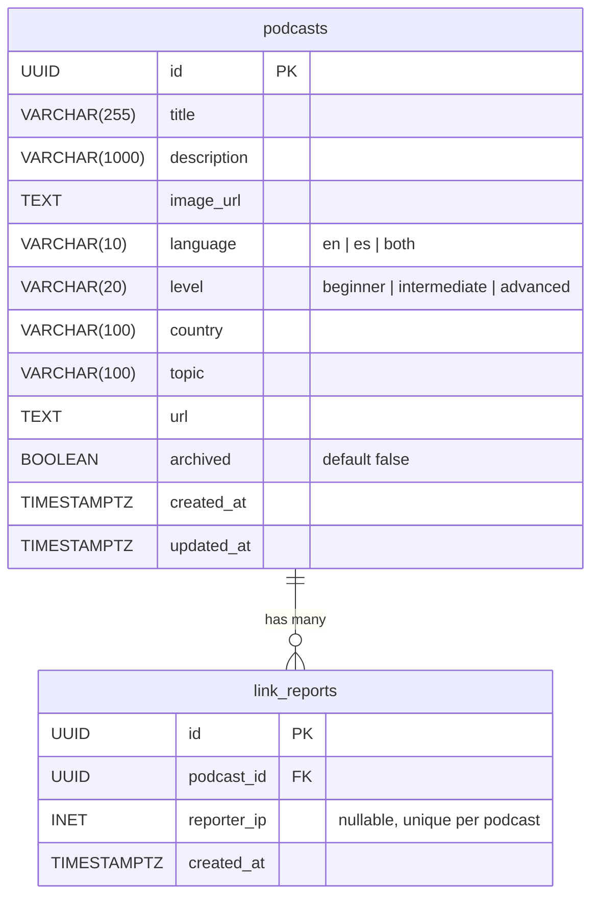
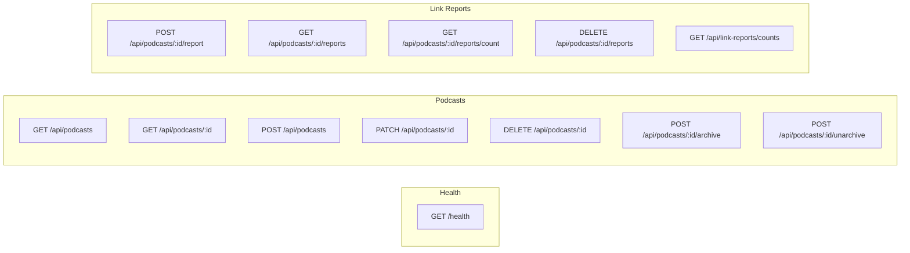
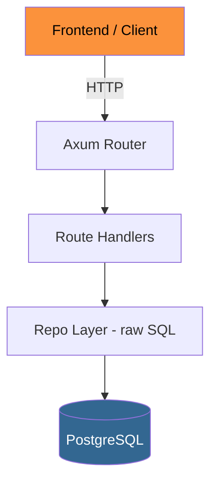

# Hablemos Backend

REST API for the [Spanish-English Discord](https://github.com/Jaleel-VS/the-spanish-english-discord-server) community website. Rust rewrite of the [original Go backend](https://github.com/Jaleel-VS/spa-eng-discord-website-backend).

## Stack

- [Rust](https://www.rust-lang.org/) (2024 edition)
- [Axum](https://github.com/tokio-rs/axum) — HTTP framework
- [SQLx](https://github.com/launchbadge/sqlx) — async Postgres with compile-time checked queries
- [PostgreSQL](https://www.postgresql.org/) — database
- [Docker](https://www.docker.com/) — containerized deployment (Railway)

## Setup

```bash
# Start a local Postgres (or use your own)
# Create database and user matching .env

# Run migrations and start the server
make dev
```

### Environment Variables

| Variable       | Required | Default | Description          |
|----------------|----------|---------|----------------------|
| `DATABASE_URL` | Yes      | —       | Postgres connection string |
| `PORT`         | No       | `8080`  | Server listen port   |
| `RUST_LOG`     | No       | `info`  | Tracing log filter   |

## Scripts

| Command     | Description                    |
|-------------|--------------------------------|
| `make dev`  | Run the server (`cargo run`)   |
| `make test` | Run tests (single-threaded)    |

## Database Schema



## API Endpoints



### Podcasts

| Method   | Path                           | Description              | Auth  |
|----------|--------------------------------|--------------------------|-------|
| `GET`    | `/api/podcasts`                | List (filtered, paginated) | —   |
| `GET`    | `/api/podcasts/:id`            | Get by ID                | —     |
| `POST`   | `/api/podcasts`                | Create                   | Admin |
| `PATCH`  | `/api/podcasts/:id`            | Partial update           | Admin |
| `DELETE` | `/api/podcasts/:id`            | Delete                   | Admin |
| `POST`   | `/api/podcasts/:id/archive`    | Archive                  | Admin |
| `POST`   | `/api/podcasts/:id/unarchive`  | Unarchive                | Admin |

#### Query params for `GET /api/podcasts`

`language`, `level`, `country`, `topic`, `includeArchived`, `page`, `pageSize`

### Link Reports

| Method   | Path                              | Description                  | Auth  |
|----------|-----------------------------------|------------------------------|-------|
| `POST`   | `/api/podcasts/:id/report`        | Report dead link (IP-deduped) | —    |
| `GET`    | `/api/podcasts/:id/reports`       | List reports for podcast     | Admin |
| `GET`    | `/api/podcasts/:id/reports/count` | Count reports for podcast    | Admin |
| `DELETE` | `/api/podcasts/:id/reports`       | Clear reports for podcast    | Admin |
| `GET`    | `/api/link-reports/counts`        | All podcast report counts    | Admin |

## Architecture



No service layer — handlers call repo directly (YAGNI). Repo functions are free functions taking `&PgPool`.

```
src/
├── main.rs           # Entrypoint: config, DB pool, server
├── config.rs         # Env-based config
├── error.rs          # AppError → HTTP response mapping
├── db.rs             # Pool setup, migrations, health check
├── routes/
│   ├── mod.rs        # Router assembly
│   ├── health.rs
│   ├── podcast.rs
│   └── link_report.rs
├── models/
│   ├── podcast.rs    # Podcast, CreateInput, UpdateInput, Filters
│   └── link_report.rs
└── repo/
    ├── podcast.rs    # Podcast SQL queries
    └── link_report.rs
```

## TODO

- [ ] Movies resource — new table, CRUD endpoints, filters (genre, language, country, level), pagination, search
- [ ] Admin authentication (API key or JWT)
- [ ] Rate limiting on public endpoints
- [ ] Books, courses, conversation, music resource endpoints
- [ ] Seed data script for local development
- [ ] CI pipeline (cargo test, clippy, fmt check)
- [ ] OpenAPI / Swagger spec generation
